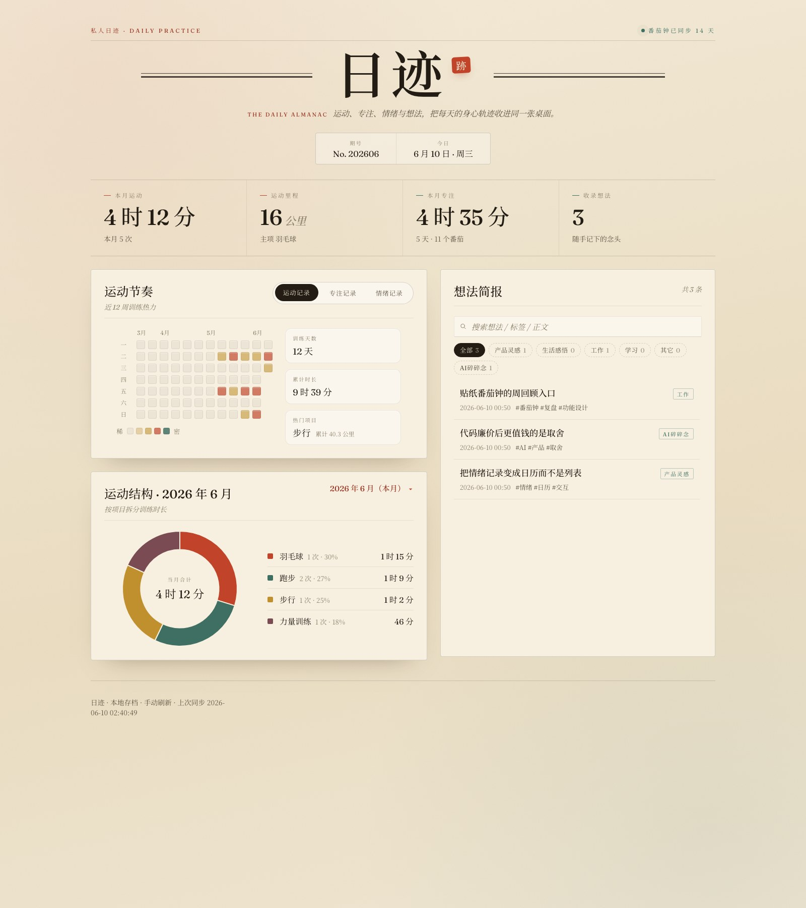
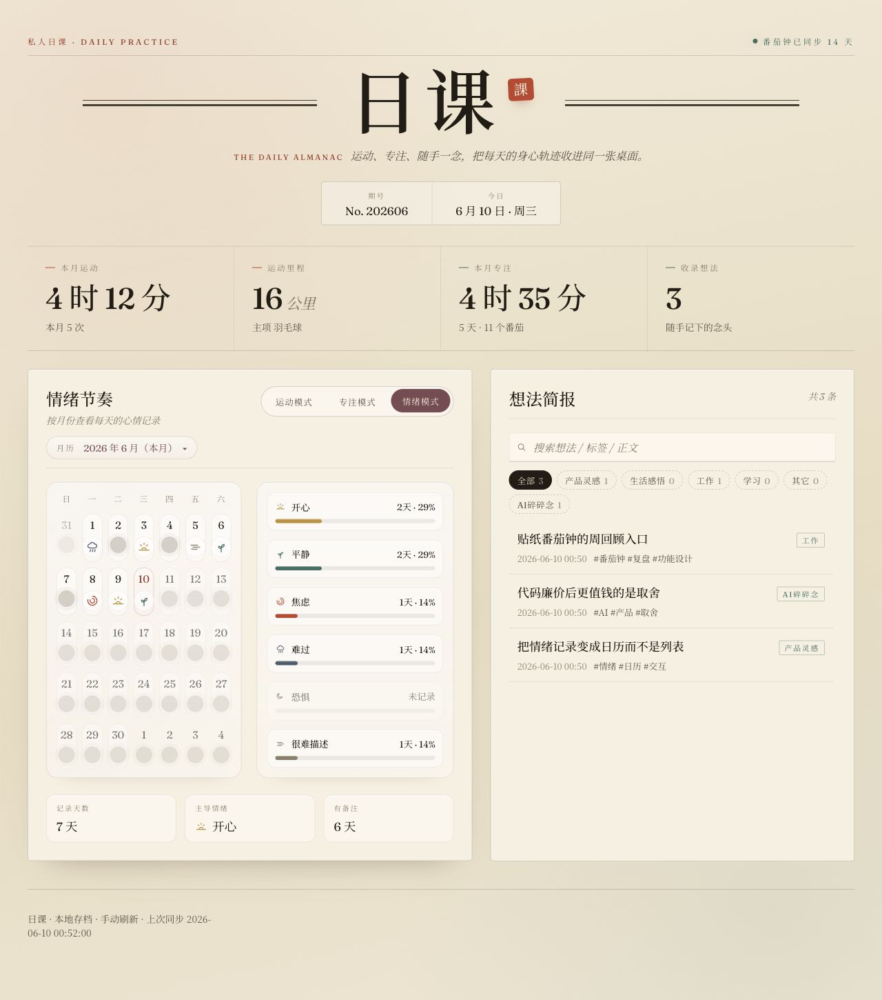
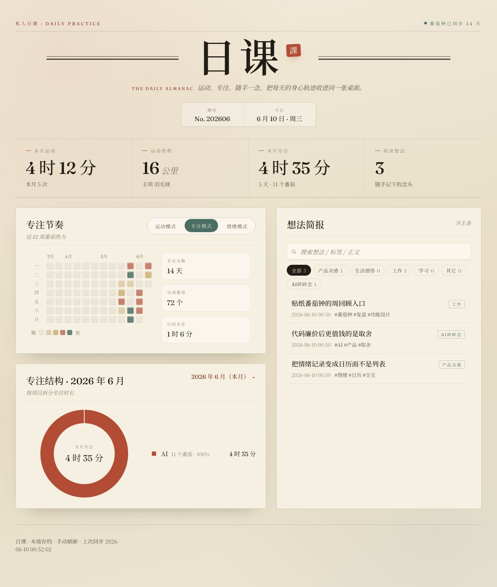

# 日迹 · WeChat AI Assistant

一个本地优先的微信助手，把几类日常记录放进同一套工作流里：

- 运动记录
- 贴纸番茄钟专注同步
- 情绪记录
- 想法笔记整理

你可以先只用命令行和本地网页，不接微信也能完整使用。  
等本地跑通后，再接 OpenClaw 和微信。

## 这是什么

这套项目分成两层：

1. 本地 Python 引擎  
   负责解析你的输入、存 SQLite、写 Markdown、生成看板数据。
2. 微信通道  
   负责把微信消息转发给本地引擎，再把结果回给微信。

所以它不是“微信里临时拼 prompt 的机器人”，而是：

- CLI、微信、本地看板共用一套数据
- 不接微信也能先跑
- 以后换模型、换通道，核心数据和逻辑都还在

## 截图预览

> 以下截图全部来自仓库自带的隔离演示数据，不包含任何真实个人记录。





## 现在能做什么

### 1. 记录运动

你可以直接说：

- `今天跑步 5 公里 32 分钟`
- `晚上练胸 45 分钟`
- `今天练了个上肢，差不多半小时`

当前支持识别这些运动类别：

- `跑步`
- `骑行`
- `游泳`
- `步行`
- `瑜伽`
- `羽毛球`
- `篮球`
- `足球`
- `力量训练`

解析方式是：

- 先用本地规则直接识别
- 实在太口语、太模糊时，再调用 LLM 做结构化补全

### 2. 同步贴纸番茄钟专注数据

你可以直接说：

- `看看这个月专注了多久`
- `这周专注怎么样`
- `同步一下番茄钟`

如果你已经在 macOS 上用贴纸番茄钟，程序会优先尝试自动读取这些常见路径：

- `~/Library/Application Support/com.stickerpomodoro.mac/settings.json`
- `~/Library/Application Support/com.stickerpomodoro/settings.json`

如果你的路径不同，再手动填写 `pomodoro_settings_path`。

### 3. 记录情绪

你可以直接说：

- `今天有点焦虑`
- `今天心情很好`
- `今天因为开会有点难过`
- `记录情绪`

看板里会按月历展示每天的情绪，点图标可以看备注。

### 4. 整理想法笔记

你可以直接说：

- `我想给番茄钟加个多人协作`
- `我突然觉得代码廉价后更值钱的是取舍`
- `这本书里关于长期主义那段我很有感觉`
- `记下来`

想法会被整理成 Markdown，存到 `data/notes/<分类>/`，同时进入本地看板。

## 想法记录是怎么互动的

这里不是“所有想法都用同一套追问”。

系统会先判断这条想法更像哪种性质，再决定怎么聊：

### 可执行 / 计划类

例如：

- 新功能
- 产品点子
- 方案设计
- 想做的项目

通常会继续追问 1 到 3 轮，例如：

- 你想解决谁的什么问题？
- 比现在的做法好在哪？
- 最不确定的假设是什么？

整理出来的笔记里，通常会更容易带出：

- 核心想法
- 背景 / 动机
- 可行的下一步
- 值得挑战的一点

### 来源型想法

例如：

- 来自一本书
- 来自一篇文章
- 来自播客、课程、访谈

系统会优先问清：

- 来源名称是什么
- 是哪一点触发了你
- 你是认同、反对，还是想延伸

这样同一本书、同一篇来源可以并到同一条笔记里，不会越记越散。

### 感受 / 观察 / 随想

例如：

- 一句临时感受
- 一个观察
- 一段不想展开太多的碎碎念

这类一般只会轻轻追问一次，或者直接收尾，不会硬挖。

### 复盘类

例如：

- 今天踩了什么坑
- 这次沟通里学到了什么
- 下次应该怎么做

这类通常会更偏向：

- 发生了什么
- 最值得记住的一条经验
- 下次如何避免重蹈覆辙

### 重要说明

“怎么互动” 和 “最后存到哪个分类” 是两件独立的事。

也就是说：

- 你可以自定义分类
- 分类不限制成固定几类
- 但系统内部仍会把想法收敛成更稳定的几种“性质”，保证互动方式比较稳定

比如你自己新增一个分类叫 `AI碎碎念`，它依然可能是：

- 随想型
- 来源型
- 计划型

互动方式会按想法本身决定，不会被分类名绑死。

## 安装后默认是什么状态

这个仓库默认是 **空数据**：

- 没有任何你的运动记录
- 没有你的专注历史
- 没有你的情绪和想法
- `config.json` 不会被提交
- `data/` 目录下的本地数据不会被提交

也就是说，别人克隆后看到的是一个干净项目，不会拿到你的私人记录。

## 目录结构

```text
.
├── README.md
├── requirements.txt
├── config.example.json
├── config.py
├── cli.py
├── core/
├── dashboard/
├── skills/wechat-assistant/
├── tools/seed_demo.py
├── tests/
└── data/                  # 首次运行后自动生成，本仓库默认不提交真实数据
```

## 数据存在哪里

- SQLite：`data/ledger.db`
- 想法笔记：`data/notes/<分类>/`
- 演示数据：`data_demo/`

## 微信适配层在哪里

仓库已经内置了 OpenClaw skill 和本地适配入口：

- [skills/wechat-assistant/SKILL.md](skills/wechat-assistant/SKILL.md)
- [skills/wechat-assistant/handle.py](skills/wechat-assistant/handle.py)

它现在的原则是：

- 微信端只负责转发
- 本地 Python 引擎负责解析、入库、查询
- 不在微信适配层里额外发明业务逻辑

## 当前边界

- 数据默认纯本地存储，不自动上云
- 看板不是实时轮询，刷新页面时才会重新拉摘要
- 番茄钟同步是按需触发，不是后台每隔几分钟自动抓
- 微信端目前更适合“收到消息后响应”，不适合作为稳定定时任务平台

## 安装与接入

### 先确认你要不要接微信

如果你只是想先体验，不需要马上装 OpenClaw。

推荐顺序是：

1. 先跑本地 CLI
2. 再开本地网页看板
3. 最后再接微信

这是对小白最稳的路径，因为出了问题时更容易定位。

### 你需要先下载什么

如果你只想先本地跑起来，你只需要这些：

1. `Python 3`
2. 这个仓库代码
3. 一个可用的 LLM API key

这个项目本身的 Python 依赖只有两个：

- `requests`
- `flask`

如果你想接微信，再额外需要：

1. `Node.js`
2. `OpenClaw`
3. 微信插件 `@tencent-weixin/openclaw-weixin-cli`

### 新电脑最简单的一条命令

如果你是新电脑、还没下载这个项目，直接复制这一条：

```bash
curl -fsSL https://raw.githubusercontent.com/Yukon594/daily-practice-wechat-assistant/main/tools/bootstrap_from_github_macos.sh | bash
```

它会自动帮你：

- 从 GitHub 下载这个项目
- 选择安装目录
- 创建 `.venv`
- 安装依赖
- 生成 `config.json`
- 让你直接输入 LLM API key
- 安装完成后可直接进入命令行模式

注意：

- 当脚本问“安装到哪里”时，最稳的做法是直接回车用默认目录
- 不要输入带英文冒号 `:` 的 Finder 风格路径

### 已经下载仓库后的本地安装

如果你已经手动下载好了仓库，再执行这条：

```bash
bash tools/install_macos.sh
```

这个本地安装脚本会自动帮你：

- 创建 `.venv`
- 安装依赖
- 生成 `config.json`
- 让你直接输入 LLM API key
- 安装完成后可直接进入命令行模式

### 手动安装

在项目根目录执行：

```bash
python3 -m venv .venv
source .venv/bin/activate
pip install -r requirements.txt
cp config.example.json config.json
```

如果后面重开一个终端，记得先重新激活虚拟环境：

```bash
source .venv/bin/activate
```

### 3 分钟最简配置

如果你继续用默认的 DeepSeek，最少只需要改 1 个字段：

- `llm_api_key`

如果你要换成别的模型平台，再改这 3 个字段：

- `llm_api_key`
- `llm_base_url`
- `llm_model`

默认模板是：

```json
{
  "llm_provider": "deepseek",
  "llm_api_key": "YOUR_LLM_API_KEY",
  "llm_base_url": "https://api.deepseek.com",
  "llm_model": "deepseek-chat"
}
```

其中：

- `llm_provider` 只是给人看的备注字段
- 真正参与调用的是 `llm_api_key`、`llm_base_url`、`llm_model`

`llm_base_url` 既可以填基础地址，例如：

- `https://api.deepseek.com`

也可以直接填完整接口地址，只要最终能请求到：

- `/chat/completions`

为了兼容老用户，代码里仍然接受旧字段：

- `deepseek_api_key`
- `deepseek_base_url`
- `deepseek_model`

但新安装时更推荐直接用：

- `llm_api_key`
- `llm_base_url`
- `llm_model`

如果你是常规 macOS 用户，可以先把：

```json
"pomodoro_settings_path": ""
```

保持留空，程序会先自动找常见路径。

### 先用命令行跑通

```bash
python3 cli.py
```

你可以试这些：

- `今天跑步5公里 32分钟`
- `看看这个月专注了多久`
- `今天有点焦虑`
- `我想给番茄钟加个周回顾入口`

单条测试也可以：

```bash
python3 cli.py --once "今天跑步5公里 32分钟"
python3 cli.py --once "看看这个月专注了多久"
python3 cli.py --once "我想给番茄钟加个周回顾入口"
```

### 启动本地网页看板

```bash
python3 dashboard/app.py
```

然后打开：

- [http://127.0.0.1:9900](http://127.0.0.1:9900)

### 想先看效果？用演示数据

仓库带了一个隔离演示数据工具，它只会写到 `data_demo/`，不会碰你的真实数据。

```bash
python3 tools/seed_demo.py
ASSISTANT_DATA_DIR=./data_demo python3 dashboard/app.py
```

清空演示数据：

```bash
python3 tools/seed_demo.py --clear
```

### 微信接入

这一段假设你还没有安装 OpenClaw。

根据 OpenClaw 官方 Getting Started 文档，建议：

- Node.js 24
- 或至少 Node.js 22.19+

先检查：

```bash
node --version
```

安装 OpenClaw：

```bash
curl -fsSL https://openclaw.ai/install.sh | bash
```

如果命令还找不到，先把它加入 PATH：

```bash
export PATH="$HOME/.openclaw/bin:$PATH"
```

初始化向导：

```bash
openclaw onboard --install-daemon
```

安装微信插件：

```bash
npx -y @tencent-weixin/openclaw-weixin-cli install
openclaw gateway restart
openclaw channels login --channel openclaw-weixin
```

建议补两条配置：

```bash
openclaw config set session.dmScope per-account-channel-peer
openclaw config set channels.openclaw-weixin.botAgent "WeChatAssistant/0.3.0"
```

正式拿微信聊之前，先在本地测这几个命令：

```bash
python3 skills/wechat-assistant/handle.py --text "今天跑步5公里 32分钟" --format json
python3 skills/wechat-assistant/handle.py --text "看看这个月专注了多久" --format json
python3 skills/wechat-assistant/handle.py --text "我想给番茄钟加个周回顾入口" --session-id wechat:test
python3 skills/wechat-assistant/handle.py --text "记下来" --session-id wechat:test
```

### 对贴纸番茄钟用户最简单的路径

如果你本来就在用贴纸番茄钟，最短路径其实是：

1. 安装 Python 依赖
2. 复制 `config.example.json` 为 `config.json`
3. 填好 `llm_api_key` / `llm_base_url` / `llm_model`
4. 直接运行：

```bash
python3 cli.py
python3 dashboard/app.py
```

如果专注数据没有自动出现，再回头补 `pomodoro_settings_path`。

## 测试

```bash
python3 -m unittest \
  tests.test_config \
  tests.test_exercise \
  tests.test_assistant_engine \
  tests.test_mood \
  tests.test_notes \
  tests.test_dashboard_data \
  tests.test_focus_sync
```

## 参考文档

- OpenClaw Getting Started: [https://docs.openclaw.ai/start/getting-started](https://docs.openclaw.ai/start/getting-started)
- OpenClaw WeChat Channel: [https://docs.openclaw.ai/channels/wechat](https://docs.openclaw.ai/channels/wechat)
